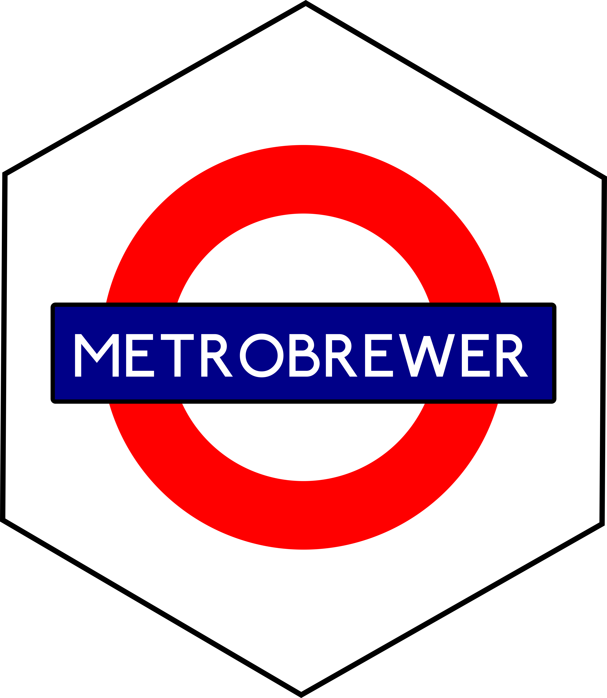

<!-- README.md is generated from README.Rmd. Please edit that file -->

```{r, include = FALSE}
knitr::opts_chunk$set(
  collapse = TRUE,
  comment = "#>",
  fig.path = "man/figures/README-",
  out.width = "100%"
)
```

# Metro Brewer 

Palettes inspired by metro and train lines. Metro Brewer package is
inspired on [`MetBrewer`](https://github.com/BlakeRMills/MetBrewer)
package.

# Content

[Installation](#install-package)

[Palettes](#palettes)

## Install Package {#install-package}

```{r install metroviewer, eval=T}
devtools::load_all()
```

## Palettes {#palettes}

```{r load cities CRAN, eval=T, echo=FALSE}
cities <- names(MetroBrewer::MetroPalettes)
```

```{r get maps, echo=F}
maps <- vector("character", length = length(cities))
for (city in cities){
  city.un <-unique(stringr::word(city, 1, sep="_"))
  map.pos <- grep(city.un, list.files("PaletteImages"))

  maps[which(cities == city)] <- paste0("PaletteImages/", list.files("PaletteImages")[map.pos])
  
}

```

```{r create cols, echo=F, eval=T}
for(i in seq_along(cities)){
cols <- paste0("PaletteImages/palettes/", cities[i], ".png")
if(!file.exists(cols)){
  png(cols, height = 150, width = 150, units="mm", res=300)
  print.palette(metro.brewer(cities[i]))
  dev.off()
}
}

  png("PaletteImages/palettes/blank.png", height = 80, width = 150, units="mm", res=300)
  par(bg="transparent")
  plot.new()
  dev.off()
```
```{r get cols, echo=F}
cols <- vector("character", length = length(cities))
for (city in cities){
   cols[which(cities == city)] <-  paste0("PaletteImages/palettes/", city, ".png")
}

```

```{r plot map&col, echo=F, eval=T, out.width="50%", out.height="80%", }
mix <- c(rbind(maps,cols))
knitr::include_graphics(mix)


```


