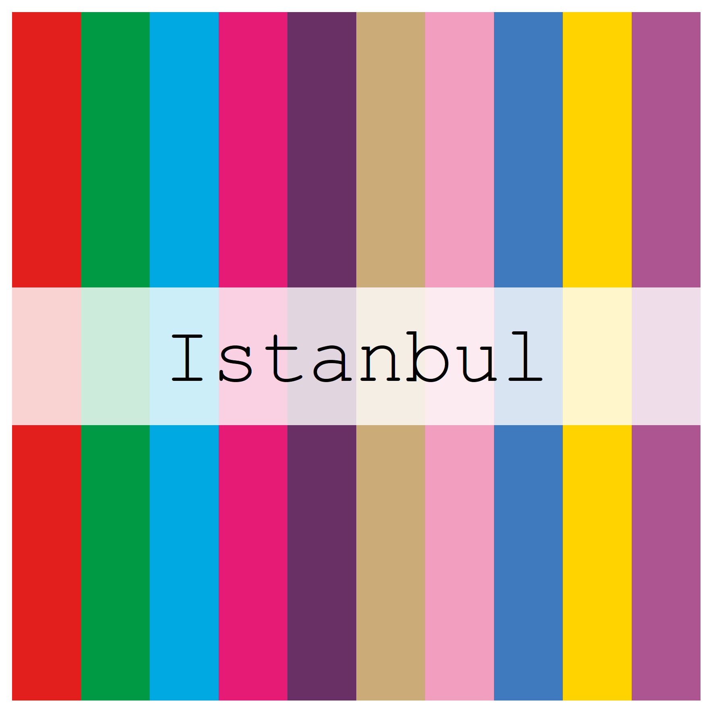
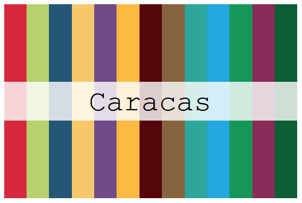
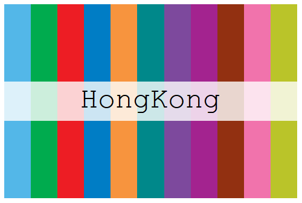
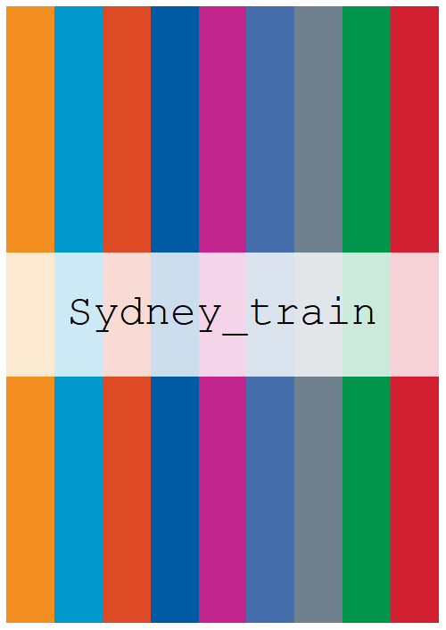

<!-- README.md is generated from README.Rmd. Please edit that file -->

# Metro Brewer 

Palettes inspired by metro and train lines. Metro Brewer package is
inspired on [`MetBrewer`](https://github.com/BlakeRMills/MetBrewer)
package by Blake Robert Mills. Palettes inspired by metro and train
lines. Metro Brewer package is inspired on
[`MetBrewer`](https://github.com/BlakeRMills/MetBrewer) package by Blake
Robert Mills.

## Install Package

``` r
devtools::install_github("juliagdealedo/MetroBrewer")
library(MetroBrewer)
```

## Palettes

## All palettes



## Maps and their colours


