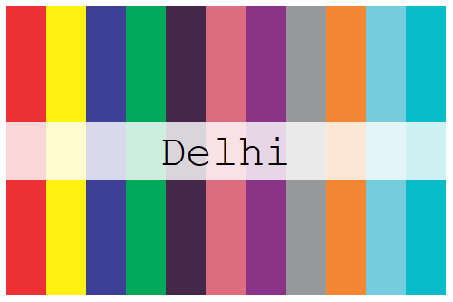
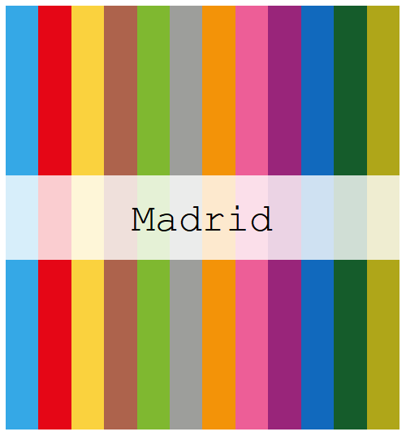

<!-- README.md is generated from README.Rmd. Please edit that file -->

# Metro Brewer 

Palettes inspired by metro and train lines. Metro Brewer package is
inspired on [`MetBrewer`](https://github.com/BlakeRMills/MetBrewer)
package.

# Content

[Installation](#install-package)

[Palettes](#palettes)

## Install Package

``` r
devtools::load_all()
#> ℹ Loading MetroBrewer
```

## Palettes

    #> quartz_off_screen 
    #>                 2


