<!-- README.md is generated from README.Rmd. Please edit that file -->

# Metro Brewer 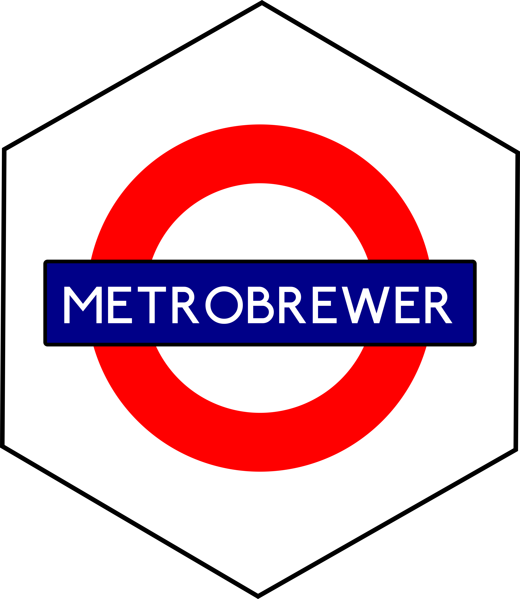

This package compile palettes with the colors of metro and train lines
from different cities of the world.

Incorporate in your visualizations the distinctive colors of your
favorite city’s metro into your graphs and other vizs! Metro lines,
inherently distinct, offer significant utility in categorical
visualizations. Moreover, the familiarity with the metro map facilitates
quick and effortless identification of categories or factors, making the
data interpretation process more intuitive.

MetroBrewer is a dynamic package, then additional suggestions are
welcome. Let us know and we will add the colors of your city metro to
the package!

This package was possible, inspired and forked from
[`MetBrewer`](https://github.com/BlakeRMills/MetBrewer) package by Blake
Robert Mills (Thank you!).

## Install Package

``` r
devtools::install_github("juliagdealedo/MetroBrewer")
library(MetroBrewer)
```

## Palettes

## All palettes

Colors are arranged by the metro lines number.

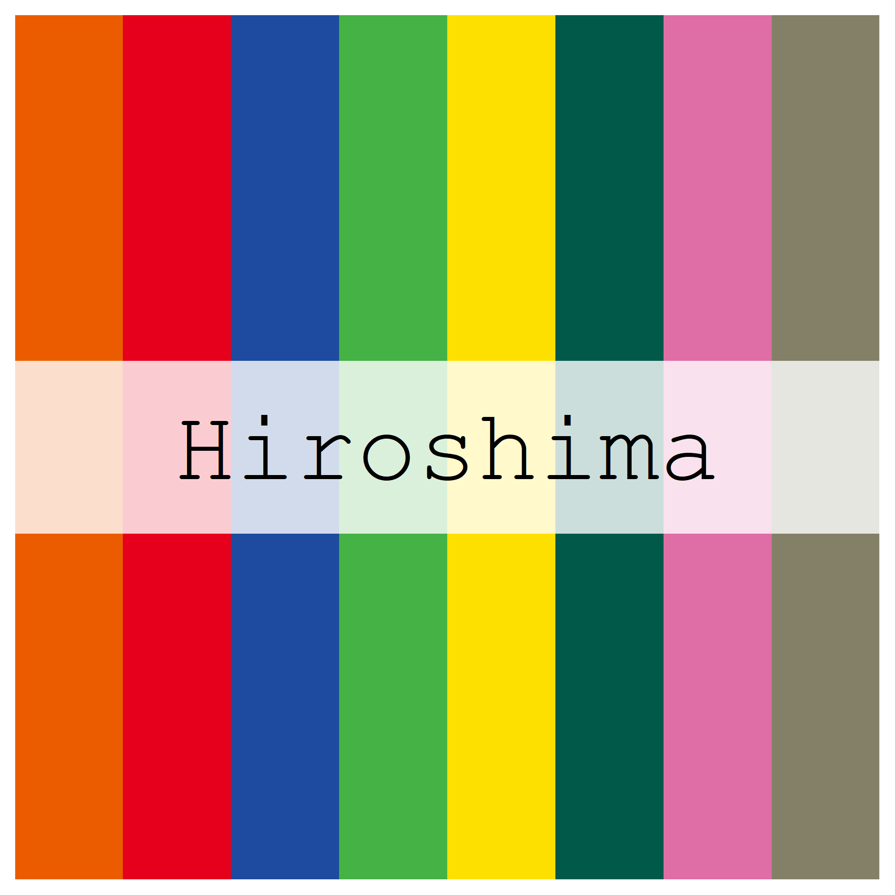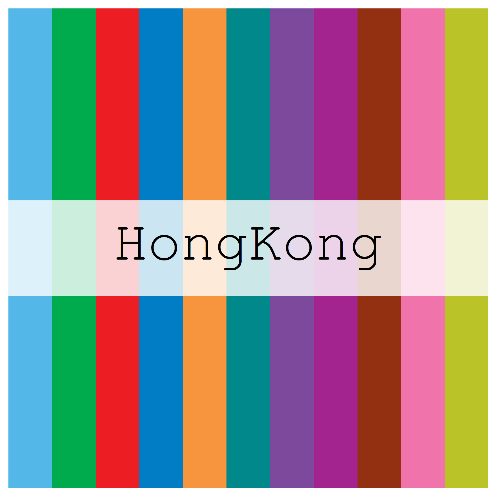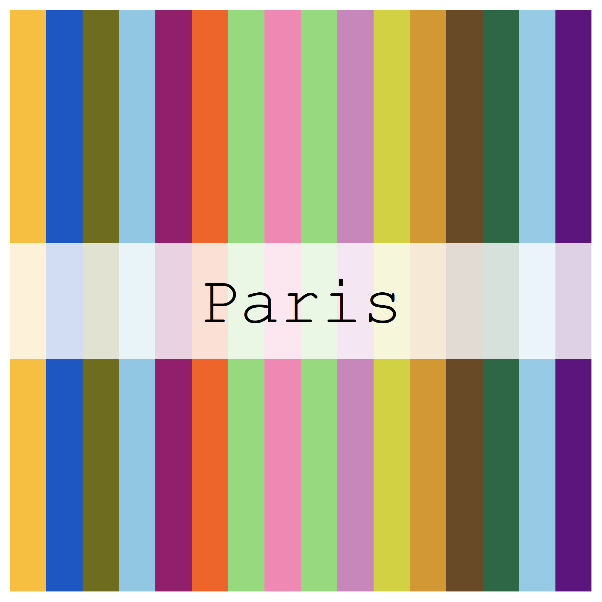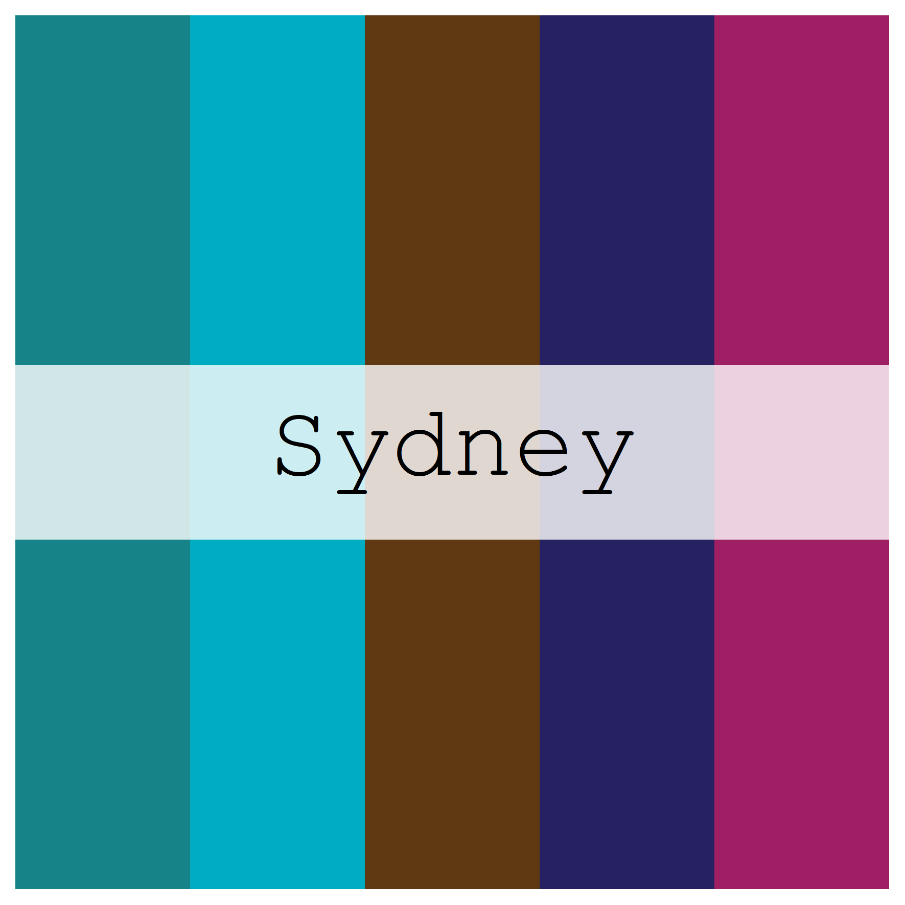

## Maps and their colours

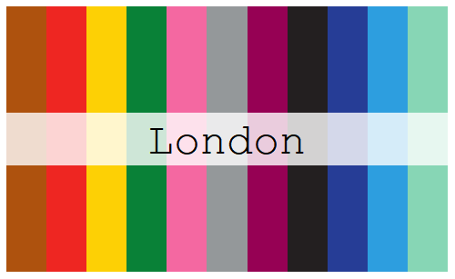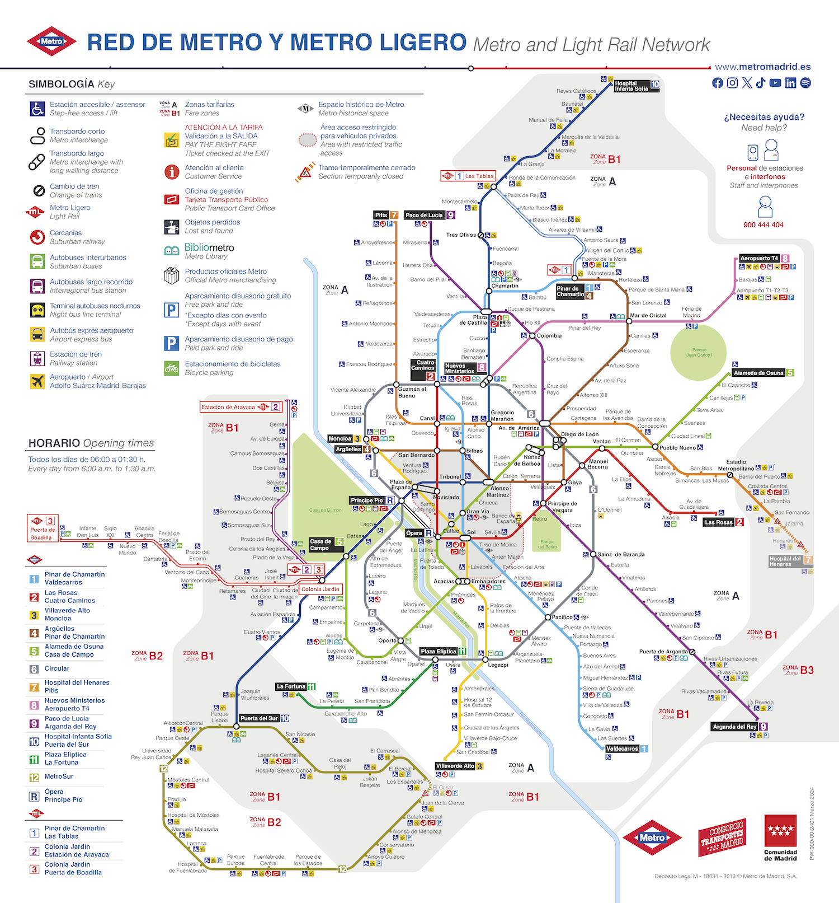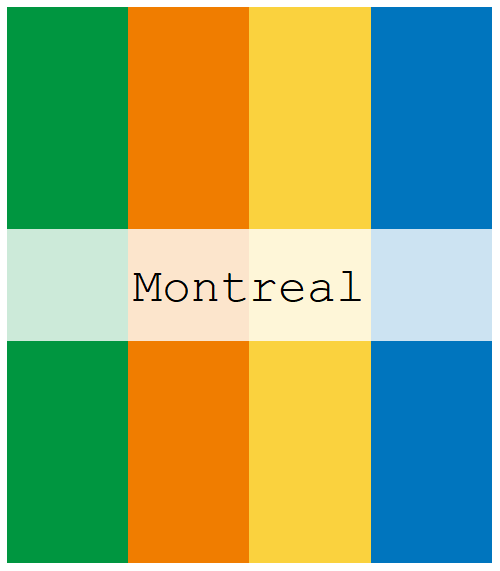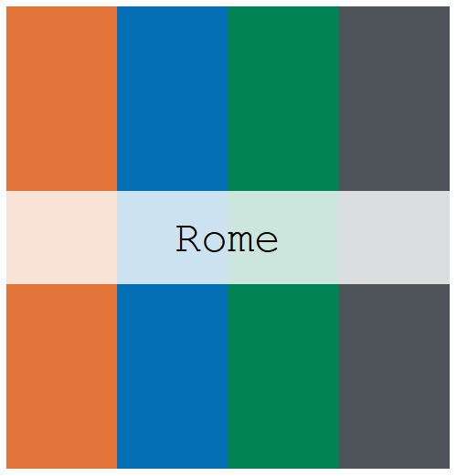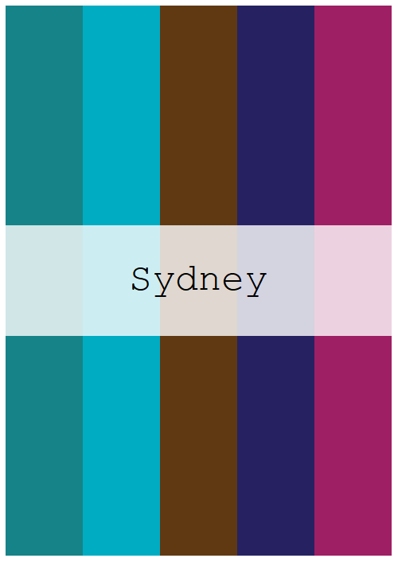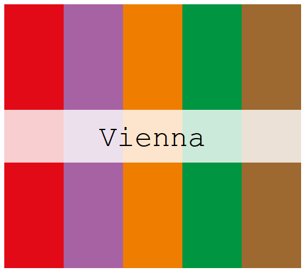
